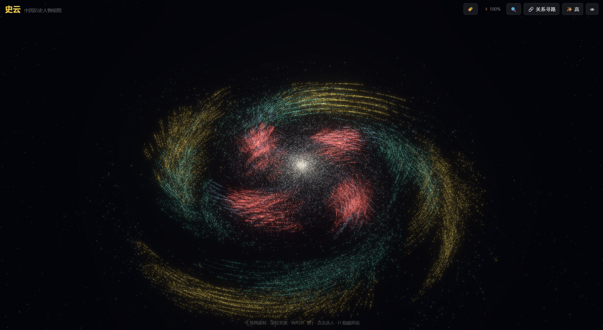
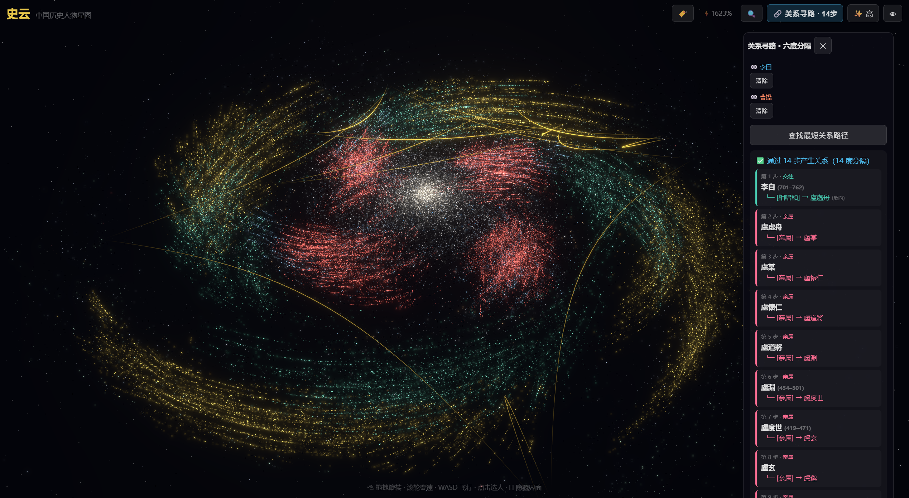
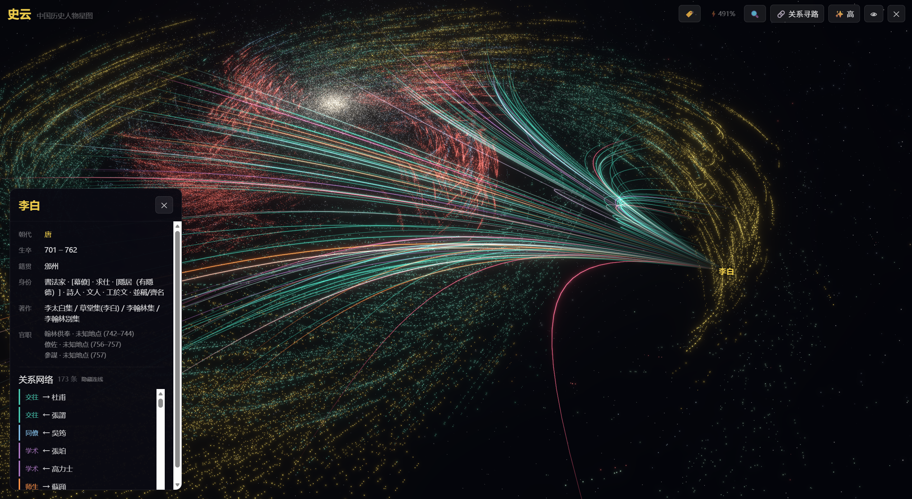

<div align="center">

# 史云 · 中国历史人物星图

**把中国历代历史人物放进一片可以漫游的三维星系。**<br/>每个人物是一颗星，星与星之间是师生、亲属、交往、同僚的关系网络。

灵感来自 [诗云 (Poetry Cloud)](https://github.com/Cohenjikan/shiyun) —— 从"诗"的星系到"人"的星系。

[](https://threejs.org)
[](https://react.dev)
[](https://www.typescriptlang.org)
[](#-快速开始)

</div>

---

## 这是什么

一个 **3D 星系可视化** 的中国历史人物知识图谱。在深邃的太空中漫游，每位历史人物都是一颗星，按照朝代排列在同心球壳上。点击一颗星即可查看人物详情，选中人物后可以看到 Ta 与其他人之间的师生、亲属、交往、同僚、学术关系网络。

**从先秦到近现代，跨越数千年的历史人物，都在这一片宇宙里。**

> 🖥 **PC 端体验最完整。** 鼠标飞行、拾取与关系网在大屏下最舒适。

---

## 功能

| 能力 | 说明 |
|---|---|
| **3D 星系漫游** | WASD 飞行、鼠标旋转、滚轮缩放，自由穿梭于历史人物星河 |
| **朝代筛选** | 按朝代（先秦→近现代）过滤显示，同心球壳分布 |
| **人物搜索** | 按姓名搜索，快速定位到任意历史人物 |
| **人物详情** | 点击人物显示生平信息：生卒年、籍贯、官职、著作等 |
| **关系网络** | 选中人物后显示其师生/亲属/交往/同僚/学术关系弧线 |
| **路径查找** | 查找任意两个历史人物之间的关系路径（六度分隔） |
| **画质切换** | 高/低画质切换，适配不同性能设备 |
| **纯静态** | 所有数据与渲染都在浏览器完成，无需后端服务器 |

---

## 截图

<table>
<tr>
<td width="50%"><br/><sub><b>人物星系总览</b> — 每颗星是一个历史人物，按朝代分布在不同半径的球壳上。</sub></td>
<td width="50%"><br/><sub><b>关系网络与路径查找</b> — 选中人物后显示师生/亲属/交往等关系弧线，支持查找两人之间的最短关系路径。</sub></td>
</tr>
<tr>
<td width="50%"><br/><sub><b>人物搜索</b> — 按姓名搜索，快速定位到任意历史人物，查看生平信息与著作。</sub></td>
</tr>
</table>

---

## 技术栈

**Vite + React 18 + TypeScript + three.js / @react-three (fiber · drei · postprocessing) + zustand**

- **渲染**: @react-three/fiber + @react-three/drei + @react-three/postprocessing (Bloom 辉光)
- **状态管理**: zustand
- **3D 引擎**: three.js r169
- **数据管线**: Node.js 脚本从原始语料提取人物与关系数据

---

## 🚀 快速开始

```bash
npm install
npm run dev      # 开发预览（Vite，端口 5200）
npm run build    # 类型检查 + 静态构建 → dist/
```

> Node 20+。仓库自带预构建数据（public/data/），可直接运行。

### 数据管线

如需从原始语料重建数据：

```bash
npm run pipeline:persons    # 提取人物数据
npm run pipeline:relations  # 提取关系数据
npm run pipeline:build      # 构建索引
npm run pipeline:all        # 一键运行全部管线
```

---

## 项目结构

```
src/
├── data/          # 数据类型定义、数据加载、图算法
├── engine/        # 3D 位置计算
├── state/         # zustand 全局状态
├── three/         # 3D 渲染：星系、人物星点、关系连线、飞行控制
├── ui/            # 界面面板：HUD、搜索、人物详情、朝代筛选、路径查找
├── App.tsx        # 应用入口
└── main.tsx       # React 挂载点
pipeline/          # 数据管线脚本（Node.js）
public/data/       # 预构建的人物与关系数据
```

---

## 致谢

本项目仿照 [诗云 (Poetry Cloud)](https://github.com/Cohenjikan/shiyun) 的架构与 3D 星系交互模式构建，将"诗"的星系改为了"历史人物"的星系。

**站在这些开源工作之上：**
- [three.js](https://threejs.org) / [@react-three/fiber · drei · postprocessing](https://github.com/pmndrs/react-three-fiber)
- [React](https://react.dev) / [Vite](https://vitejs.dev) / [zustand](https://github.com/pmndrs/zustand)
- [诗云](https://github.com/Cohenjikan/shiyun) —— 架构灵感与 3D 星系交互模式来源
- 历史人物数据整理自公开语料

---

## 许可

MIT License

<div align="center">
<sub>从先秦到近现代，无数历史人物在这片星河中闪耀。</sub>
</div>
